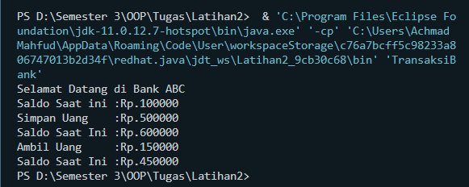

# **Latihan 2**

## Program : 
```sh 
public class AkunBank {
    String sambutan;
    int saldosekarang;
    int simpanuang;
    int ambiluang;
}
```
```sh
public class TransaksiBank {
    public static void main(String[] args){
        AkunBank transaksi = new AkunBank();

        transaksi.sambutan = "Selamat Datang di Bank ABC";
        transaksi.saldosekarang = 100000;
        transaksi.simpanuang = 500000;
        transaksi.ambiluang = 150000;
        System.out.println(""+ transaksi.sambutan);
        System.out.println("Saldo Saat ini :Rp." + transaksi.saldosekarang);

        System.out.println("Simpan Uang    :Rp."+ transaksi.simpanuang);
        System.out.println("Saldo Saat Ini :Rp."+(transaksi.saldosekarang + transaksi.simpanuang));

        System.out.println("Ambil Uang     :Rp."+ transaksi.ambiluang);
        System.out.println("Saldo Saat Ini :Rp."+ (transaksi.saldosekarang + transaksi.simpanuang - transaksi.ambiluang));


    }
}
```
## Output Program :  
